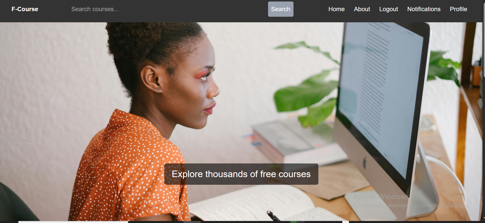
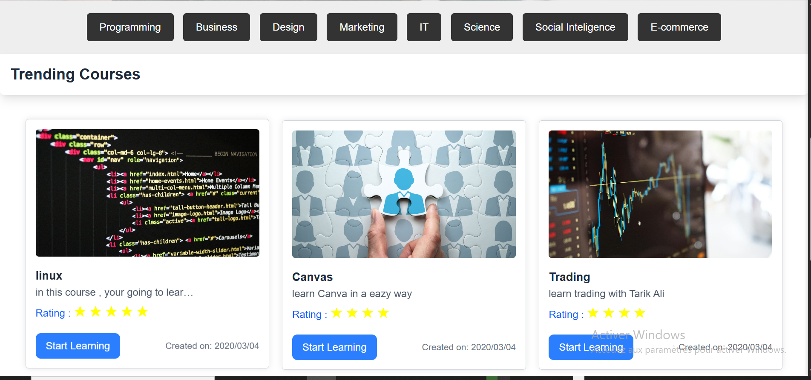
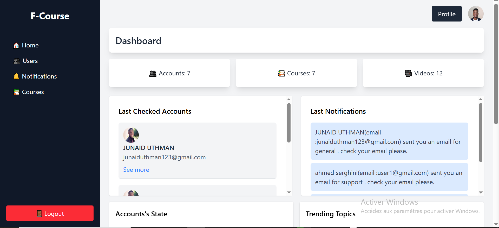
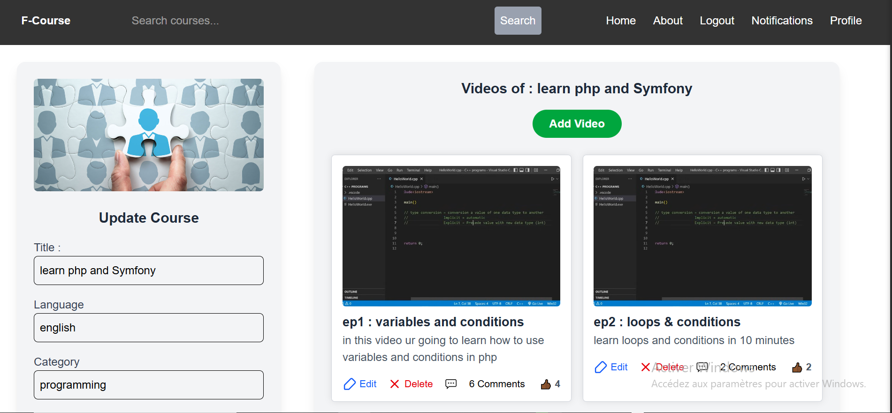
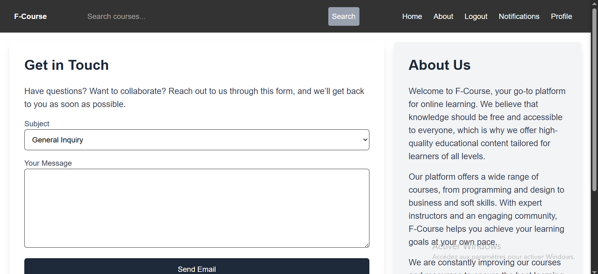
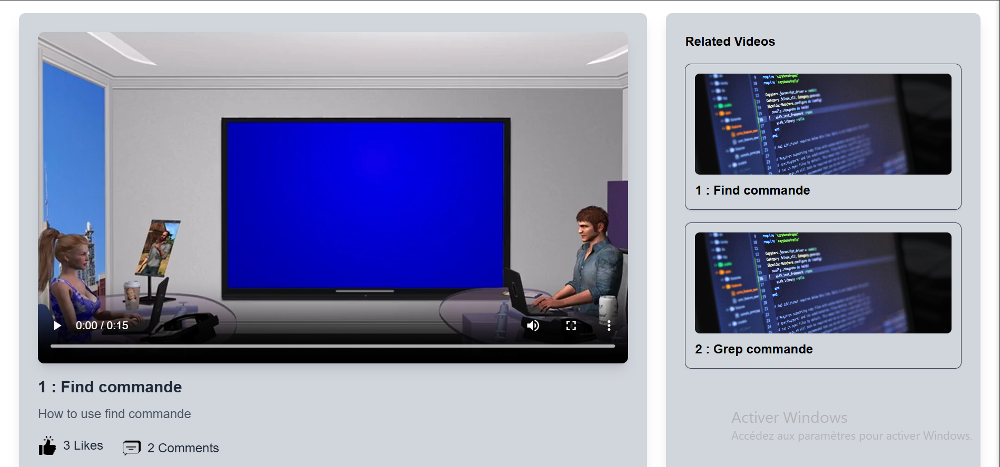

Free Course Web Application
 A full-featured web application for posting and learning courses across different subjects, with
   separate user and administration spaces. 
 Built with Symfony (PHP) and MySQL for the backend, and HTML, Tailwind CSS, and JavaScript
   for the frontend.

HomePage (user) : 

DashBoard (admin) : 

updatePage

aboutPage : 

learningPage : 

